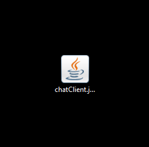
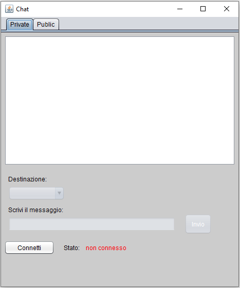
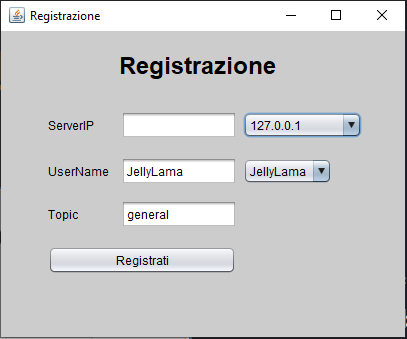
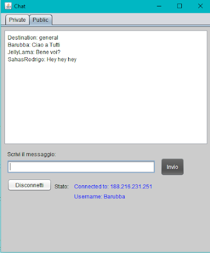
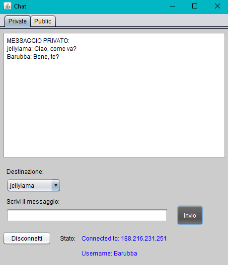
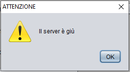

#

# Chat Client

# User Guide

# Team 4

Team Members

Bachir Karim

Er raqioui Sabrina

Montresor Riccardo

Senapathige Rodrigo Sahas

Toth Valentin

# Contents

 Introduction        (page 3)

 Usage Guide (from page 3 to 5)

 System Requirements        (page 6)

 Troubleshooting        (page 6)

# 1 Introduction

The chat Client application allows users to chat with who ever they want, but only if they have this app,  from a pc.  This document will provide instructions for using the application and especially to register, view and write messages in the public channel, view and write messages in the private channel with single users.

# 2 Usage Guide

1. Double click on the app icon. The initial screen will be brought up.  

2. Enter or select the servers IP address, your username and the topic.  

3. Click &quot;Registrati&quot; (register) button.
4. If everything goes well the chat will appear with the connection status and your username on the bottom.

5. Now you&#39;re logged in and ready to chat!
6. To write a message in the public channel click on the &quot;Public&quot; tab on the top and write your message in the text field.
7. To send your message click the &quot;Invio&quot; (send) button, your message will be displayed on the text area above.
8. When someone sends a message to the public channel it will be displayed in the text area with the name of the sender.
9. If you want to chat with a specific user in private, you must:
    1. click the &quot;Private&quot; tab on the top.  
    
    2. Select the user you want to chat with.
    3. Write and send your message as shown in the public channel tab.
    4. When you change the destination user the text area will display the related messages.
 
10. Once you have finished to chat and you want to quit the application you must click the &quot;Disconnetti&quot; (disconnect) button before clicking the top right &quot;X&quot;.
This to correctly disconnect the client from the server.

# 3 System Requirements

The chat Client application should be installed on a Microsoft Windows pc.  It&#39;s a very lightweight application so the only thing that you need is an internet connection.

# 4 Troubleshooting

## 4.1Server not functioning or offline
  
-If a message like this appears this means that the server may be offline or not functioning.
